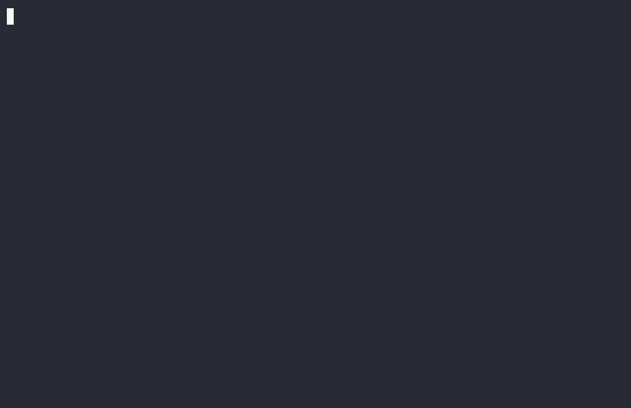

# Secure Devtools

Dev-time security tools for detecting compromised code, dependencies, and supply-chain risks — designed to run locally and in CI, and to be small enough to audit.

> **Zero npm runtime dependencies.** The shipped tools are plain shell — there is no dependency tree to audit at
> install time. `am-i-compromised` needs only `bash`, `ripgrep`, and `jq`; `secure-semgrep` also
> needs `semgrep` on the host. npm devDependencies exist only for local tooling (husky git hooks
> and the bats test suite).

[](https://opensource.org/licenses/MIT)
[](https://github.com/IsaacBell/secure-devtools/actions/workflows/ci.yml)
[](https://www.npmjs.com/package/am-i-compromised)
[](https://www.npmjs.com/package/am-i-compromised)
[](#)
[](CONTRIBUTING.md)

## See it in action



## Packages

| Package | Description |
| --- | --- |
| [`am-i-compromised`](apps/am-i-compromised/README.md) | Compromise scanner - checks for malicious code and compromised files. Publishes to npm. |
| [`secure-semgrep`](apps/secure-semgrep/README.md) | Bundled Semgrep rules + loadout packs for AI-agent, bash & web security scans. Publishes to npm. |

## Requirements

- [mise](https://mise.jdx.dev) — installs the security toolchain (`node`, `pnpm`, `shellcheck`,
  `shfmt`, `ripgrep`, `jq`, `semgrep`, `trivy`) declared in [`mise.toml`](mise.toml)
- [pnpm](https://pnpm.io) — for package release/distribution

## Quick start

```sh
mise install     # install the pinned toolchain
mise run setup   # install JS deps + git hooks (== pnpm install)
mise run check   # lint + format check + tests
```

`mise run` on its own lists every task.

## Commands

Tasks are defined in [`mise.toml`](mise.toml).

| Task | What it does |
| --- | --- |
| `mise run` | list all tasks (default) |
| `mise run setup` | install JS deps and git hooks |
| `mise run check` | shellcheck + shfmt check + bats tests (what CI runs) |
| `mise run test` | bats test suite only |
| `mise run lint` | shellcheck only |
| `mise run fmt` | format shell sources (shfmt) |
| `mise run fmt-check` | verify formatting without changing files |
| `mise run gate` | security-gate scan of the whole repository |
| `mise run semgrep` | semgrep scan of this repo in review mode (evidence, exit 0) |
| `mise run semgrep-strict` | same scan, but exit 1 on any finding (gate) |
| `mise run semgrep-check` | validate every bundled `secure-semgrep` rule parses |
| `mise run publish-dry-run` | preview what `npm publish` would ship (`am-i-compromised`) |
| `mise run publish` | publish `am-i-compromised` to the npm registry |
| `mise run publish-secure-semgrep-dry-run` | preview the `secure-semgrep` tarball |
| `mise run publish-secure-semgrep` | publish `secure-semgrep` to the npm registry |
| `mise run doctor` | diagnose the dev environment (`mise doctor`) |

Git hooks are installed by husky during `pnpm install` and run `mise run check` on every
commit.

## Repository layout

- `apps/am-i-compromised/` — the npm package (see its [README](apps/am-i-compromised/README.md))
- `apps/am-i-compromised/test/__security_gate_fixtures__/` — quarantined malware samples used to
  test the scanner (**never execute or import these**)
- `.github/workflows/` — CI: checks + security gate + gitleaks secret scan + dependency review
  + CodeAnt AI scan (opt-in via repository variable)
- `mise.toml` — tool versions and tasks, shared by local dev and CI

## Contributing

See [CONTRIBUTING.md](CONTRIBUTING.md) for setup, commands, and guidelines. All
contributions are welcome — open an [issue](https://github.com/IsaacBell/secure-devtools/issues)
or a pull request.

## Security

This project's purpose is security, so vulnerabilities are taken seriously. See
[SECURITY.md](SECURITY.md) for the disclosure process. 

**Please do not open public issues for security problems.**

### Semgrep

[`secure-semgrep`](apps/secure-semgrep/README.md) is the repo's static-analysis pack: bundled, owned rules
for AI agents and bash, plus Semgrep loadout packs you can point at any codebase. It lives in
[`apps/secure-semgrep`](apps/secure-semgrep/README.md) and publishes to npm as `secure-semgrep`, mirroring
how `am-i-compromised` is published.

Run it over this repository (review mode records findings without breaking the build):

```bash
$ mise run semgrep
```

To turn findings into a hard gate, run `mise run semgrep-strict`. In any other repository, use it the same way
as a post-`npm install` script — see the [package README](apps/secure-semgrep/README.md) for loadouts
(`react`, `ts`, `node`, `py`, `rust`) and CI snippets.

## Sponsorship

If these tools save you time or keep your projects safer, consider supporting the work:

[](https://ko-fi.com/ibell)

`npm fund` in the package also points to the same page.

## License

MIT — see [LICENSE](LICENSE).
